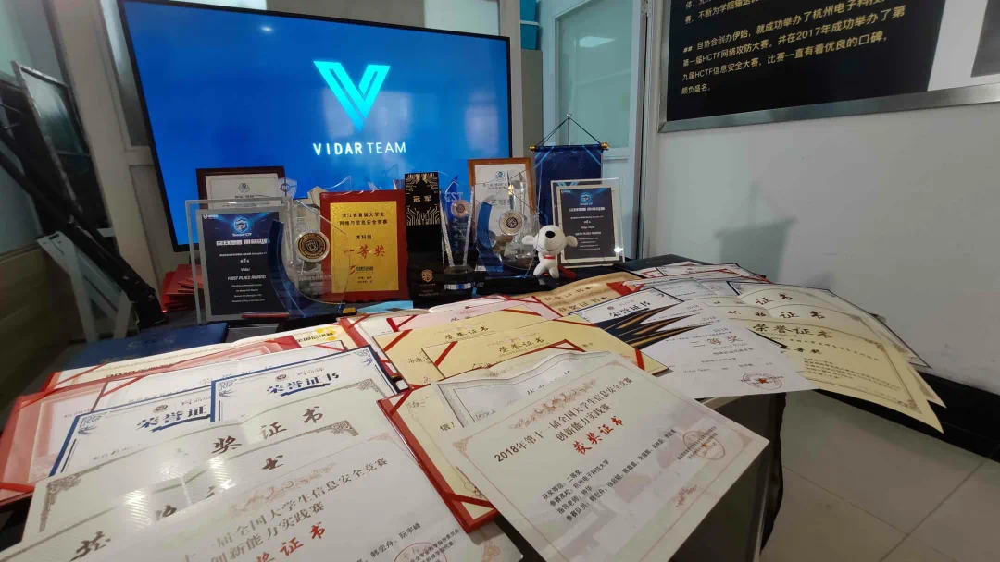
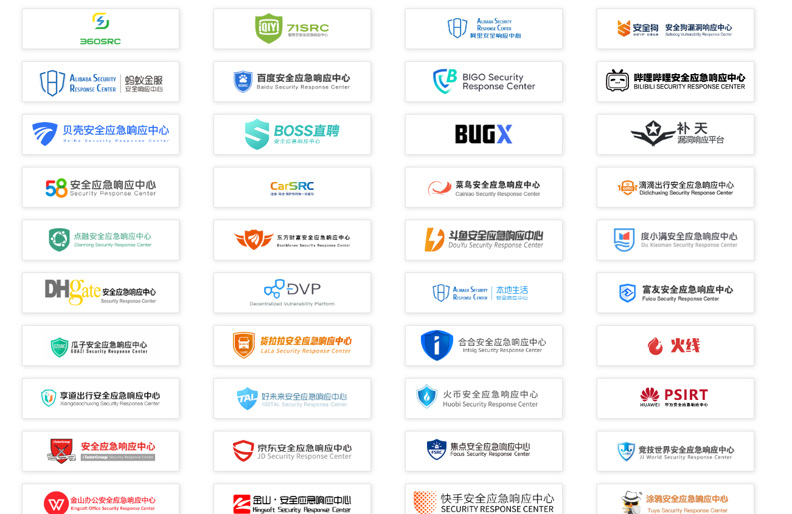

# 竞赛指北

## 竞赛可以带来什么

“哪个比赛更有含金量” 的问题应该是很多同学会关心的，然而比赛对人的帮助是因人而异的。比起列一个所谓的比赛含金量排名，笔者认为认清自己想要的是什么，再去评判比赛含金量才是有意义的。

- 如果你想要加绩点 / 德育分 / 创新学分

杭电有一份对竞赛 A 类 B 类的认定表。一般而言，A 类竞赛省赛获奖便可加 GPA，而 B 类竞赛获 GPA 需要国奖。具体 GPA 加成请以各学院认定情况为准。如果想要评奖学金或者保研的同学可以提早关注学院对竞赛加分的认定规则。

大多数比赛校赛即可加德育分。具体请以学院认定规则为准。

比赛如果加创新学分，会在比赛预热推文里指出，可以关注相关学校比赛公众号。

- 如果你想锻炼自己的技术

像 ACM、CTF 等纯技术类比赛，利用比赛锻炼技术是完全可行的；如果是含文本元素的竞赛，利用比赛驱动自己学技术相对有利有弊。利在有人催你做项目，你可以直接按照文本给的要求写项目而不用自己想 Idea 。一旦获奖，对做技术的人而言也是正反馈。而且如果团队走的足够远，会有人帮你推广你做的项目。弊端也很明显。很多含文本元素的比赛并不注重具体落地，只要文本写的够好就能入围。这种情况下

1. 有可能组内成员提出一些工作量相当大的需求（例如一个人全栈）或者以现阶段能力完全做不了的需求，来圆上之前画的饼。
2. 当发现 “只要糊弄一下套个空壳也可以” ，你可能就不想把项目落地了。这会极大地挫伤一个人独立开发完整项目的积极性。

尽管如此，对于多数杭电学生而言，参加竞赛是最好的锻炼技术的方式，对杭电而言，竞赛是不可或缺的一部分。

- 如果你想拓展人脉圈

笔者的很多朋友也都是通过竞赛认识的。通过竞赛认识朋友是很不错的选择，团队项目不仅可以增加彼此之间的交流机会，也可以让你根据这位队友在协作中的表现估摸对方的品行（当你和队友为了赶比赛 DDL 一起 Debug 到两三点、或者你发现队友摆烂什么代码也不写，你大概会更深地理解到为什么这样说）。另外，如果竞赛打的够多，也会有组员主动邀请你参加其他的项目，认识更多的人。

除了志同道合的朋友，其实你也会更容易接触到老师。对于一般路过摆烂大学生来说，见到老师无非就是在讲台上，很少有面对面交流的机会。而在比赛里，你可以和你的指导老师有更深的接触。当然，这些指导老师有很为学生着想的，也有视学生为廉价劳动力的，要注意辨别。

## 项目来源（含文本元素的竞赛）

- 祖传项目

一般来自导师 / 社团 / 学长学姐。需要一定运气。

好处是有现成文本。项目本身有基础，更容易获奖。

坏处是容易因为项目已有基础，在接手项目时只想着如何进一步包装，而缺失了自己探索项目本身课题的过程。

- 外包转竞赛项目

本来是校外组织或学校委托学生的外包项目，因各种原因顺带作为竞赛课题。

好处是本身就是落地项目，在论证项目可行性时具有很强的说服力，这类项目也相对来说会容易获奖。对于想要做实际落地项目的技术人员来说是不错的锻炼机会。

坏处是甲方<strong>可能</strong>提出大量需求，技术人员需付出大量精力跟进，然而因为项目本身参与比赛而无法收取原定的外包费用，技术人员成为白菜大学生被白嫖（当然这个潜在可能性带来的坏处也因人而异，如果不在乎频繁改动需求 / 愿意做没有外包费用的无偿奉献，只想锻炼自己，那就无所谓）。

- 自立初创项目

好处是可以做自己想做的课题。

坏处是第一年的项目会因为没什么项目基础而不容易获奖。而且如果缺乏核心人物的领导，不太容易坚持把项目做下去。

不过所有项目都始于初创项目，还是鼓励大家如果有自己的想法可以考虑初创项目。以个人体感而言，参与一个祖传项目虽然获奖相对容易，但作为一个项目的初创人，从组织团队、开发项目、打各大比赛到拿奖加 GPA ，这样的经历哪怕没拿奖也是很不错的锻炼。

## CTF (信息安全竞赛)

> CTF 能满足你对黑客的一切幻想

计算机信息安全竞赛在社会上的知名度并不高，但它和 ACM 一样是强技术竞赛，无任何 PPT 环节以及展示环节（除了一些少数比赛如国赛省赛有知识竞赛这一环节/赛道），技术就是唯一取胜的关键。CTF 是计算机安全竞赛的一种赛制，全称“Capture The Flag”，即夺旗赛，比赛选手需利用自己的计算机安全技术完成挑战，成功拿下题目后会获得一个使用`flag{}`包裹的字符串，这个字符串就是flag，提交到平台上就可以获得一定的分数。

杭电的 CTF 竞赛历史悠久，Vidar-Team 信息安全协会的主打比赛就是 CTF，据本文档编写之时算起已有 15 年的历史，大大小小国内国外获奖无数，本 wiki 的计算机安全部分也由信息安全协会编写。

### 优点

信息安全竞赛是强技术类竞赛，如果你选择计算机安全作为自己的主攻方向，该竞赛将包含几乎所有计算机安全的内容，在一个竞赛里就可以从入门到入土。

CTF 在计算机安全类招聘，以及计算机安全类研究生招生中占有很大作用，安全类企业在招聘时更喜欢 CTF 选手，就好像算法岗更喜欢 ACM 选手一样（虽然现在两者的就业都没有以前好了）。

计算机安全也是一个挑战性很强的领域，在国外有很高的研究热情，如今在国内也受政府大力支持，比如强网杯由河南省政府主办，奖金高达 500 万元，西湖论剑由浙江省政府主办，奖金也很丰厚。除此之外，在计算机安全领域还有漏洞赏金这一说，大型企业都会有 SRC（Security Response Center，安全应急响应中心）这种平台，上交该企业的漏洞就可以获得赏金，比如微软 RDP 远程代码执行漏洞（通过一定手段使得另一台电脑执行任意代码）赏金高达 10 万刀。VMware 虚拟机逃逸（在虚拟机内通过一定的手段可以在主机上执行任意代码）20 万刀等，越有挑战性的领域赏金越高。国内的SRC平台：https://www.anquanke.com/src

### 缺点

CTF 的缺点在于受学校支撑不大，学校不重视该比赛（但又有什么关系呢），CTF 浙江省省赛由杭电“主办”，为省A类竞赛，获一等奖可加 0.7 GPA（大约能让你三等奖学金（450元）变一等奖学金（1500元），但奖学金对于找工作其实没啥用），并且每队（3人）奖金 3 千元。全国大学生信息安全竞赛为B类竞赛，和省赛同等待遇。除该两个比赛以外，剩下的比赛学校均不认可（近年来强网杯等政府主办比赛也稍微提高了认可度）。但浙江省省赛在社会上的认可度远不如国赛和其他企业/战队主办的比赛。如果你想依靠竞赛去争取杭电可怜的保研名额，老老实实打数模这种杭州电子数模大学高度认可的比赛，不要选 CTF。

CTF还有的缺点也是目前热门领域的通病：发展速度过快，后来者需要学的东西越来越多越来越难越来越边缘。计算机安全作为一个对抗性比较强的课题（像人工智能里面的对抗性学习一样，两个AI互相下棋），发展速度是日新月异的，所以入行越晚风险越大。

--- 

更多可以参考计算安全章节

[传送门](/6.%E8%AE%A1%E7%AE%97%E6%9C%BA%E5%AE%89%E5%85%A8/6.%E8%AE%A1%E7%AE%97%E6%9C%BA%E5%AE%89%E5%85%A8.html)

## 数据科学竞赛

这个比赛在一些学校相较而言比较冷门，但是含金量不低，奖项也相较而言比较丰厚，如果对数据科学比较感兴趣（4.8章节）的同学可以进一步了解

同时我在这里附上一些有意义的链接

竞赛日历：http://coggle.club/

最新的竞赛信息和baseline推送，请关注：

竞赛公众号：Coggle数据科学
知乎专栏：机器学习理论与数据竞赛实战

## 数模竞赛（某学长的建议）

高中阶段，可能大家很多都把很多的精力放在了主修的课程中，常参加竞赛的精力少之又少，而大学和高中很大的一个不同点就在于，我们可以不把所有的精力都放在课程的学习上，还有很多的选择，比如选择一个自己感兴趣的社团，或者选择一个适合自己的竞赛，

比如 ACM，智能车，数模等等，虽然我是搞数模的，但是在这些竞赛里，如果是计算机类的专业还是推荐尽量的去搞 ACM ，哈哈，当然很多人会觉得奇怪，为什么我一个搞数模的会推荐 ACM 嘞，因为不得不说 ACM 无论是在考研还是就业都是占着很大的优势，

但是可能有人会问，那你当初为什么不选择 ACM，而是选择了数模呢？哈哈，其实也很容易想到，因为我不配，哈哈，ACM 和数模很大的不同，首先就是参赛队伍的不同，ACM 国赛参赛队伍就 14 支，每支队伍三个人，而数模国赛队伍今年 65 支，所以相对于数模来说，ACM 的淘汰率很高，要求也很高，没有一定的天赋，和极大的兴趣，是很难坚持下来的，但是数模不同，由于参赛队伍比较多，要求自然也就下降了，但是这并不意味着竞争就会减弱，毕竟也是 A 类竞赛，数模的竞争主要是区分努力与不努力的人。

在数模暑期集训的时候，老师会布置好多个集训的模型，和组织上课，强度是比较大的，所以很多都是坚持不下来的人都是主动退出的，所以无论是选择哪个竞赛，都要有坚持下来的决心，因为坚持不下来无论选择什么竞赛都是没有结果的哟~

因为，看这偏小文章的大部分人，可能没接触过数模竞赛的偏多，所以，我大概介绍一下数模比赛。首先，就是数模比赛的内容，数模比赛的时间是三天时间，一般发题的时间是下午 8 点左右发题，然后是三天后这个点之前上交自己的数模论文。

对于数模论文的组成，主要是 11 个部分， 1.摘要 2.问题重述 3.问题分析 4.模型假设 5.符号说明 6.模型的建立 7.模型求解 8.模型的检验 9.模型评价及推广 10.参考文献 11.附录，其实你们通过这些部分的展示应该就可以看出来，这数模论文的想达到的最终目的是讲解清楚自己解决一个问题的过程和结果，为了能够清楚的表达出我们的思路和想法，我们也常利用一些形象图和流程图来展示。这时候可能有人会问，那这数模和高中的应用题有什么区别嘞，其实我的看法是一脉相承，可以说，数模是应用题的前身。

哈哈听起来是不是很玄，其实大白话来说，就是在数模在应用题的基础上多了，设计应用题的过程，在比赛过程中发的题目，其实是比较泛的，很多的细节是没有被规定的，所以我们要做的就是，在它们给出的背景里，通过假设等等手段，提取出一个具体的应用题，这个就是我们常说的模型，然后利用一定的算法求解这个应用题，就是模型的求解，哈哈，这样听起来，是不是其实数模离我们也并不远，高中经常接触到。这时候，你们也可能会问，那如果要学习数模，我们该怎么办嘞，哈哈也不用担心，其实我们都知道，想学习，就上b站（学习神器）

这里我比较推荐的课程是清风的课程，清风老师讲解是比较偏小白教学的，当然这不是免费的哟，一个人我记得好像是是五十几块钱，还算是比较实惠的。最后我给大家介绍一下，数学建模的一些比赛，数学建模的话主要分为两种，比较重要（即被学校认可）的比赛，如国赛和美赛，和一些训练赛，认证杯，妈妈杯，长三角等等，训练赛顾名思义就是为国赛和美赛做训练用的，所以最后主要起作用的就是美赛和国赛的所得的奖哦。

最后，祝各位想参赛的学生最后可以拿到自己理想的奖项哦。

## 智能车竞赛简介

杭电智能车比赛主要分为三大部分：竞速（电磁），竞速（视觉）与创意组.

由于笔者是创意组的，对其他组别不是很了解，就来介绍一下我们组别的情况。我们组别全称是智能车百度创意组，是由百度与鲸鱼机器人赞助的一个比较新的组别（目前是第三年，不过也开始卷起来了），该组别与传统组别的一个比较大的不同是对于硬件方面的要求并不高（但也是需要了解的，像  arduino ，stm32 这些稍微都得玩的起来），侧重会偏向软件算法方向。百度创意组总体分为两个阶段，线上赛和线下赛，线上赛的任务有点像是 kaggle 打榜，不过是百度官方命题，并且在飞浆平台上进行测试的，本质考验的就是你对神经网络的理解和调参（炼丹），如下图所示

